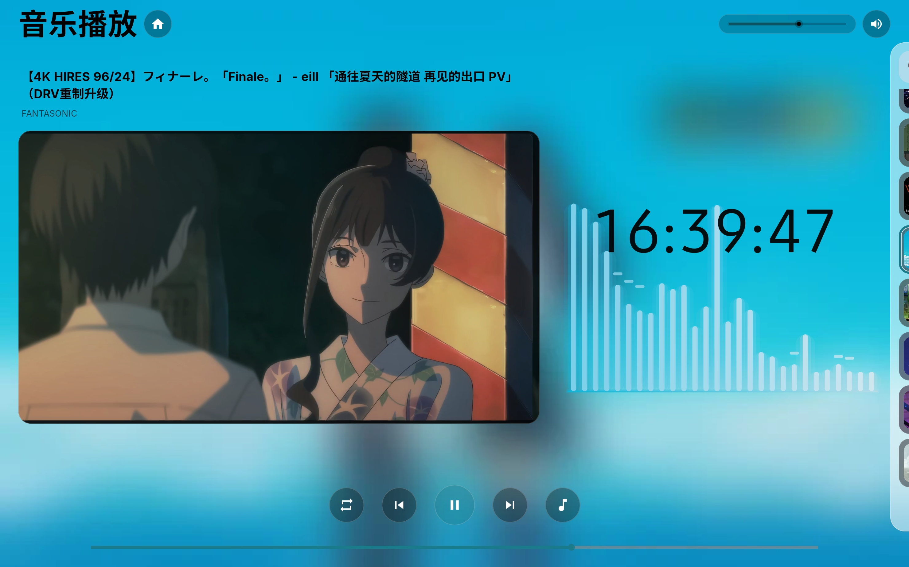
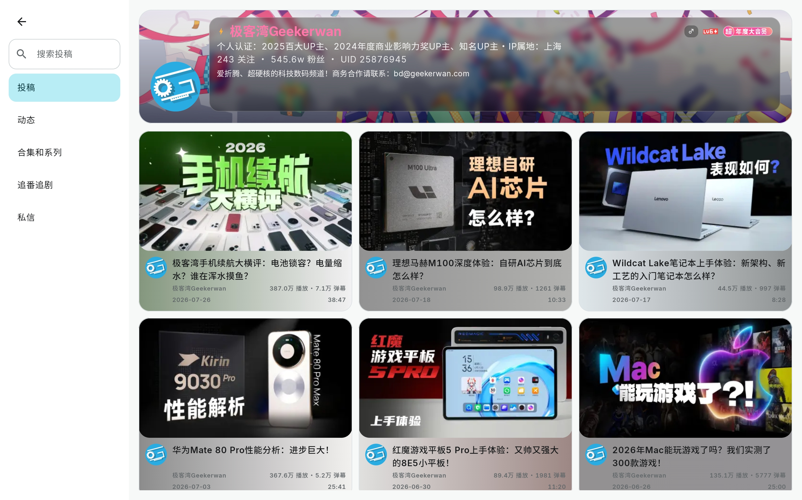
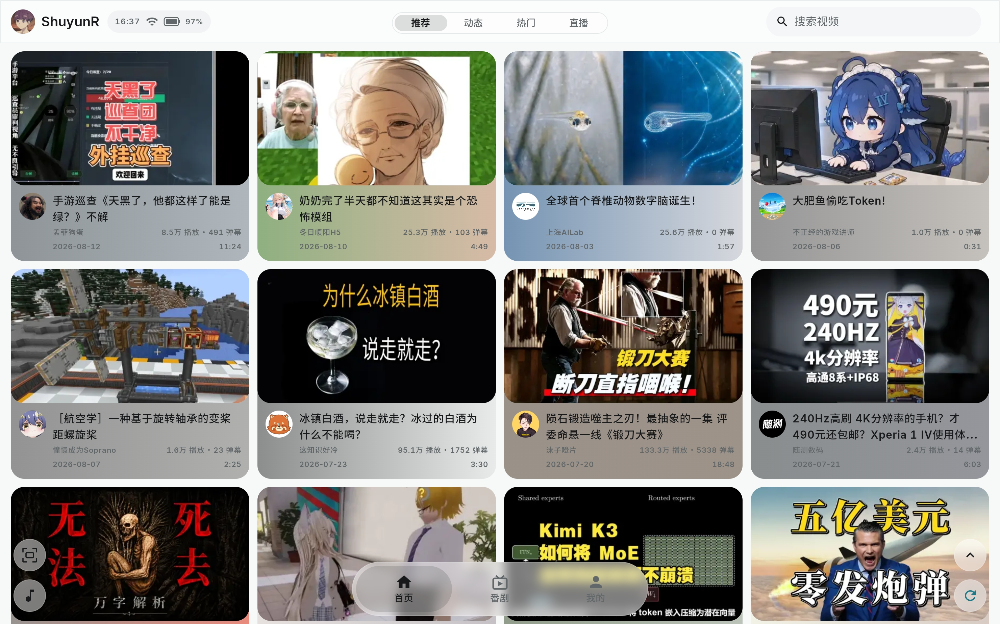
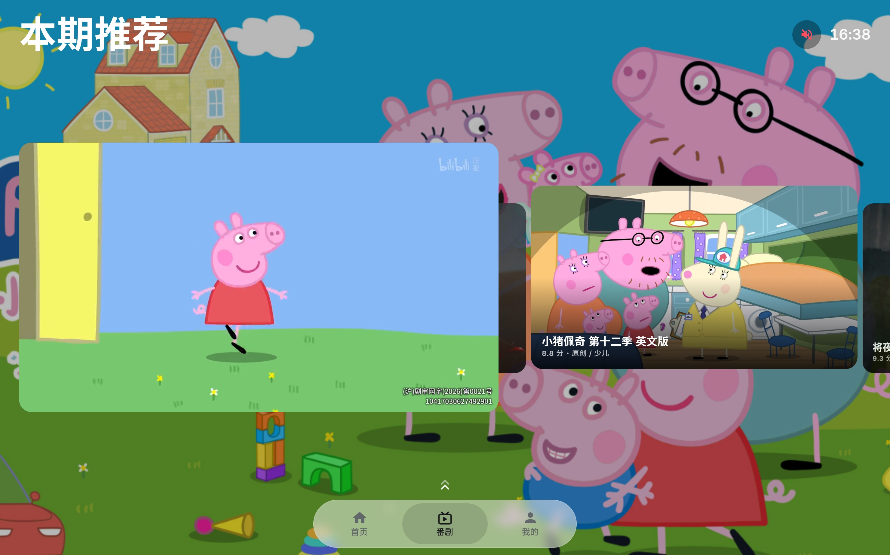

# BiliOne

面向平板大屏的哔哩哔哩第三方客户端。

BiliOne 是独立开发的非官方、非商业、开源的第三方客户端，专为横屏平板设计，
让浏览内容、观看视频、看弹幕与评论、管理个人内容都更简单舒适。
项目与哔哩哔哩无隶属、授权或赞助关系。

## 界面预览

大屏横屏是 BiliOne 的核心设计目标，所有页面按窗口尺寸自适应，横屏、分屏、自由窗口都能获得完整的浏览与观看体验。

## 功能

- **大屏观看**：横屏、分屏、自由窗口，页面按窗口尺寸自适应
- **视频**：清晰度与倍速切换、弹幕（智能防挡）、评论、分 P/合集、进度记忆、字幕
- **内容形态**：推荐、动态、热门、直播、音乐、番剧/影视六类索引、专栏、搜索
- **个人内容**：收藏、历史、稍后再看、关注、私信、消息、点赞消息
- **离线缓存**：在应用内缓存允许离线观看的视频，账号与授权绑定，支持 SD 卡迁移
- **基础控制器**：支持方向键、确认键、返回键及部分媒体按键导航；

> 部分个人功能（私信、稍后再看、收藏管理、关注、发弹幕、投币等）需要登录哔哩哔哩账号。

## 当前状态

当前版本 0.4.0。
功能仍在完善中，欢迎在真实设备上体验并反馈。

## 安装

1. 前往 Releases 下载 APK
2. 在系统设置中允许“安装未知应用”，完成侧载安装
3. 支持 Android 6.0（API 23）及以上

## 适配与性能

- 面向 11 英寸以上横屏平板，14 英寸左右体验更佳；小尺寸平板可运行，布局会降级
- 流畅度在骁龙 855 及以上芯片的平板上经过实测；天玑、麒麟等尚未系统性验证
- 页面转场与卡片动画在骁龙 870 性能基线设备上实测可跑满 120 FPS
- 布局按实际窗口尺寸自适应，不依赖固定分辨率或设备型号

## 使用边界

- BiliOne 不提供可导出的视频文件下载或缓存分享；离线缓存仅在应用内、账号与授权绑定范围内播放
- 不绕过会员、地区限制、DRM 或其他访问控制
- 依赖哔哩哔哩非公开网页接口，上游接口或平台规则变化可能让部分功能暂时失效
- 请遵守适用法律和相关平台规则

## 反馈

欢迎通过 Issue 反馈问题与建议。反馈时请不要公开 Cookie、Token、账号资料或私密日志。
安全问题请按 [SECURITY.md](SECURITY.md) 中的方式反馈。

## 开源

BiliOne 使用 MIT 许可开源。查看 [LICENSE](LICENSE)、[隐私说明](PRIVACY.md)、[项目范围](docs/scope.md)。
